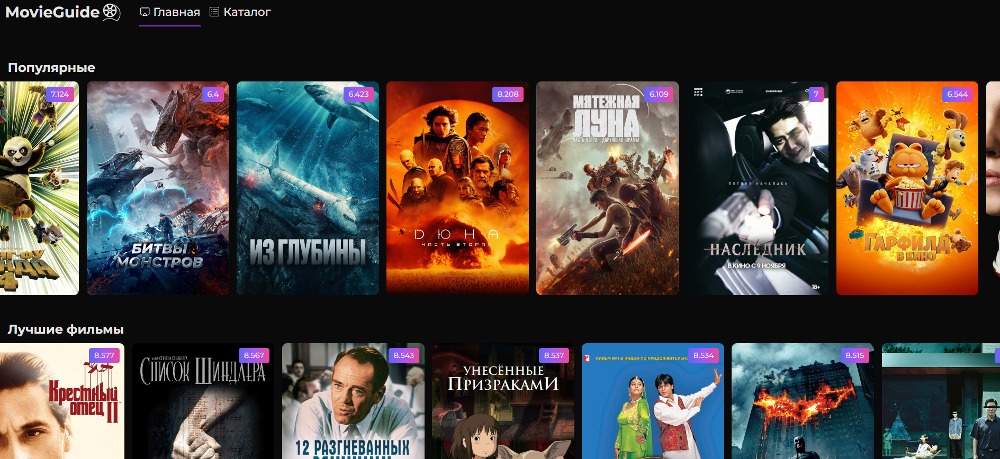
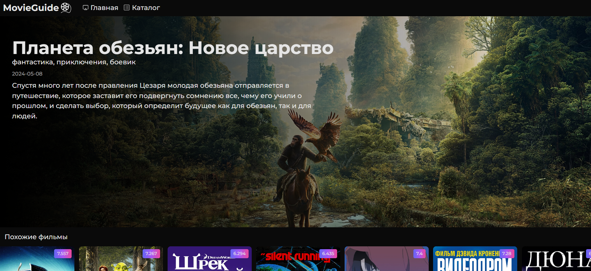

# Задание на стажировку в ВК

## 🚀 Запуск

1. Cклонируйте репозиторий.
2. В корневой директории проекта вы найдете файл `.env.example`. Скопируйте его и переименуйте копию в `.env`. Затем в файле `.env` замените VITE_TMDB_API_READ_ACCESS_TOKEN на ваш реальные токен
3. Выполните команду `npm i`.
4. Для запуска введите команду `npm run dev`.

## 🛠 Технологии

1. React
2. TypeScript
3. Vite
4. Tailwind CSS
5. FSD
6. Tanstack Query
7. Zod

